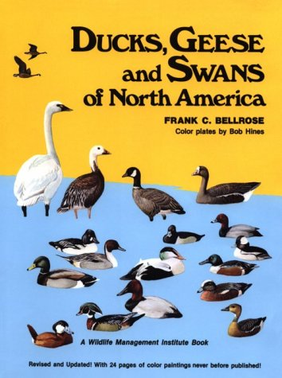
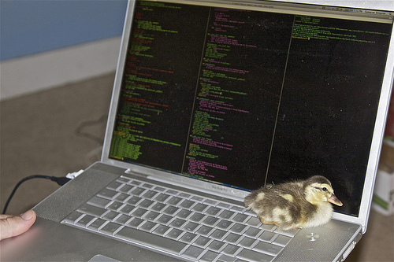

!SLIDE center

# Ruby Style

## Object-Oriented Programming

!SLIDE center

## What does a good method look like?

!SLIDE vertical-center

```ruby
def good_method
  puts "I am a good method"
end
```

!SLIDE vertical-center

## Optional parameters?

```ruby
def good_method(good_measurement='good')
  puts "I am a #{good_measurement} method"
end

!SLIDE vertical-center

## When should you use modules instead of classes?

!SLIDE vertical-center

## Namespacing

```ruby
module Math
  PI = 3.141592653589793
end
```

!SLIDE vertical-center

## You never need an instance

```ruby
module Math
  PI = 3.141592653589793
  def acos(x)
    # ... some math ...
  end
end
```

!SLIDE vertical-center

## You want to share some functionality

!SLIDE

```ruby
class Square
  attr_reader :width, :height

  def area
    # ...
  end
end

class Rectangle
  attr_reader :width, :height

  def area
    # ...
  end
end

class Triangle
  attr_reader :width, :height

  def area
    # ...
  end
end
```

!SLIDE

```ruby
module HasDimensions
  def area
    # ...
  end
end

class Square
  attr_reader :width, :height
  include HasDimensions
end

class Rectangle
  attr_reader :width, :height
  include HasDimensions
end

class Triangle
  attr_reader :width, :height
  include HasDimensions
end
```

!SLIDE vertical-center

## How do you take advantage of blocks?

!SLIDE center


!SLIDE center

## Duck typing?

!SLIDE center



!SLIDE center

